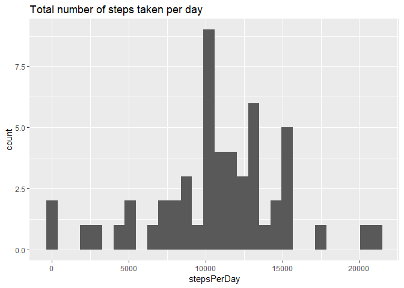
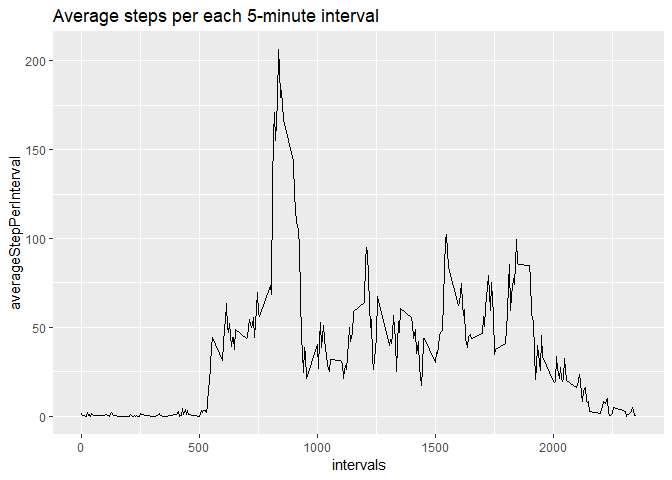
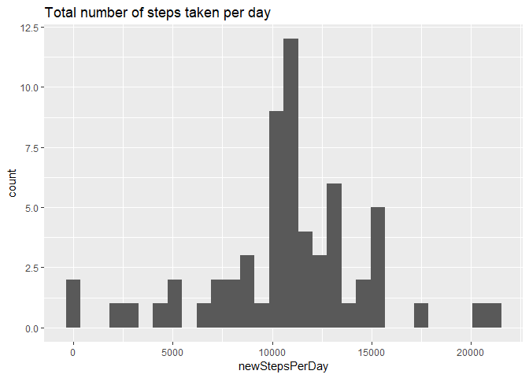
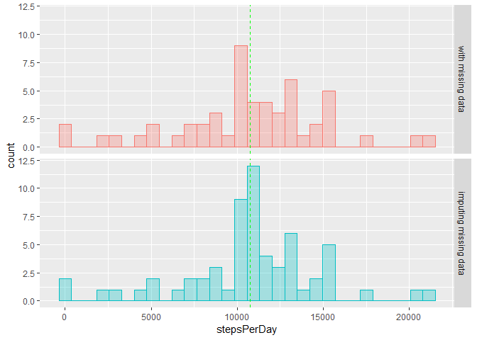
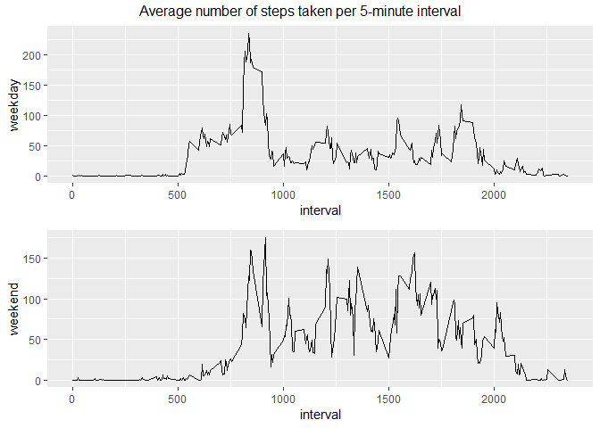

## Loading and preprocessing the data

Set woring dirctory and load data and packages.

```r
setwd("C:/Users/chri/Desktop/Coursera")
data <- read.csv("activity.csv")
library(ggplot2)
```

```
## Warning: package 'ggplot2' was built under R version 3.5.2
```

```r
library(dplyr)
```

```
## Warning: package 'dplyr' was built under R version 3.5.3
```

```
## 
## Attaching package: 'dplyr'
```

```
## The following objects are masked from 'package:stats':
## 
##     filter, lag
```

```
## The following objects are masked from 'package:base':
## 
##     intersect, setdiff, setequal, union
```

```r
library(grid)
library(gridExtra)
```

```
## Warning: package 'gridExtra' was built under R version 3.5.3
```

```
## 
## Attaching package: 'gridExtra'
```

```
## The following object is masked from 'package:dplyr':
## 
##     combine
```

## What is mean total number of steps taken per day?

Calculate the total number of steps taken each day and build a data.frame wiht date and number of steps 

```r
stepsPerDay <- with(data, tapply(steps, date, sum))
date <- unique(data$date)
data2 <- data.frame(date, stepsPerDay)
```

Make a histogram of the total number of steps taken each day

```r
ggplot(data2, aes(stepsPerDay))+geom_histogram() +
        labs(title = "Total number of steps taken per day")
```

```
## `stat_bin()` using `bins = 30`. Pick better value with `binwidth`.
```

```
## Warning: Removed 8 rows containing non-finite values (stat_bin).
```

<!-- -->

Calculate and report the mean and median of the total number of steps taken per day

```r
mean(stepsPerDay, na.rm = TRUE)
```

```
## [1] 10766.19
```

```r
median(stepsPerDay, na.rm = TRUE)
```

```
## [1] 10765
```

## What is the average daily activity pattern?

Calculate the average number of steps taken each interval and build a data.frame with date and averaged steps per interval

```r
averageStepPerInterval <- with(data, tapply(steps, interval, mean, na.rm = TRUE))
intervals <- unique(data$interval)
data3 <- data.frame(intervals, averageStepPerInterval)
```

Make a time series plot of the 5-minute interval (x-axis) and the average number of steps taken, averaged across all days (y-axis)

```r
ggplot(data3, aes(intervals, averageStepPerInterval))+geom_line() +
        labs(title = "Average steps per each 5-minute interval")
```

<!-- -->

Which 5-minute interval, on average across all the days in the dataset, contains the maximum number of steps?

```r
max_average <- max(averageStepPerInterval)
max_interval <- data3[which(data3$averageStepPerInterval == max_average), ]
```

## Imputing missing values

Calculate and report the total number of missing values in the dataset

```r
missing_values <- data[which(is.na(data$steps)), ]
nrow(missing_values)
```

```
## [1] 2304
```

Devise a strategy for filling in all of the missing values in the dataset. Average of steps taken during the interval replaces missing values

```r
interval_mean <- with(data, tapply(steps, interval, mean, na.rm = TRUE))
intervals <- unique(data$interval)
data4 <- data.frame(intervals, interval_mean)
data5 <- merge(data, data4, by.x = "interval", by.y = "intervals")
data5$steps[is.na(data5$steps)] <- data5$interval_mean[is.na(data5$steps)]
```

Create a new dataset that is equal to the original dataset but with the missing data filled in

```r
newStepsPerDay <- with(data5, tapply(steps, date, sum))
date <- unique(data$date)
data6 <- data.frame(date, newStepsPerDay)
```

Make a histogram of the total number of steps taken each day and Calculate and report the mean and median total number of steps taken per day

```r
ggplot(data6, aes(newStepsPerDay))+geom_histogram() +
        labs(title = "Total number of steps taken per day")
```

```
## `stat_bin()` using `bins = 30`. Pick better value with `binwidth`.
```

<!-- -->

```r
mean(newStepsPerDay, na.rm = TRUE)
```

```
## [1] 10766.19
```

```r
median(newStepsPerDay, na.rm = TRUE)
```

```
## [1] 10766.19
```

Do these values differ from the estimates from the first part of the assignment? What is the impact of imputing missing data on the estimates of the total daily number of steps?
To answer build a new data.frame with both values, missing and imputing values

```r
compare_data <- rbind(data.frame(date = data2$date, 
                                 stepsPerDay = data2$stepsPerDay, 
                                 type = "with missing data"), 
                      data.frame(date = data6$date, 
                                 stepsPerDay = data6$newStepsPerDay, 
                                 type = "imputing missing data"))
```

Calculate mean and median of steps per day for data with missing values

```r
type_mean <- with(compare_data, tapply(stepsPerDay, type, mean, na.rm=TRUE))
type_mean_db <- as.data.frame(type_mean)
type_median <- with(compare_data, tapply(stepsPerDay, type, median, na.rm=TRUE))
type_median_db <- as.data.frame(type_median)
```

Make a histogram with two facets and both values

```r
ggplot(compare_data, aes(stepsPerDay, color = type, fill = type)) +
        theme(legend.position = "none") +
        geom_histogram(alpha = 0.3)+facet_grid(type ~ .) +
        geom_vline(data = type_mean_db, aes(xintercept = type_mean), 
                    linetype = "dashed", color = "green")
```

```
## `stat_bin()` using `bins = 30`. Pick better value with `binwidth`.
```

```
## Warning: Removed 8 rows containing non-finite values (stat_bin).
```

<!-- -->

## Are there differences in activity patterns between weekdays and weekends?

Create a new factor variable in the dataset with two levels - "weekday" and "weekend" - indicating whether a given date is a weekday or weekend day

```r
data$day <- weekdays(as.Date(data$date))
data$day_type <- ifelse(data$day %in% c("sabato", "domenica"), "weekend", "weekday") 
```

Calculate the average number of steps taken per interval, averaged across all weekday days or weekend days

```r
interval_day_type_mean <- with(data, tapply(steps, list(interval, day_type), mean, na.rm = TRUE))
db_interval_day_type_mean <- as.data.frame(interval_day_type_mean)
db_interval_day_type_mean$interval <- intervals
```

Make a panel plot containing a time series plot

```r
p1 <- ggplot(db_interval_day_type_mean, aes(interval))+geom_line(aes(y = weekday))
p2 <- ggplot(db_interval_day_type_mean, aes(interval))+geom_line(aes(y = weekend))
grid.arrange(p1, p2, nrow=2, 
                top = "Average number of steps taken per 5-minute interval")
```

<!-- -->


